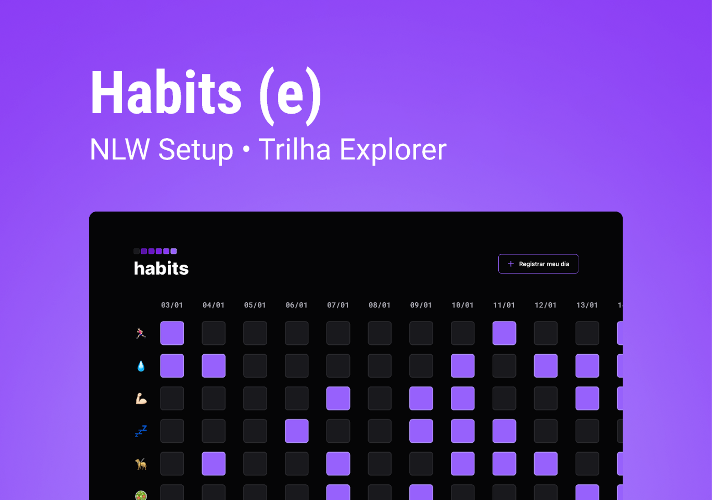

# Projeto-Habits

 ## Olá pessoal!
  Esse projeto foi desenvolvido no evento NLW Setup da Rocketseat.
 É um monitor de hábitos, com as tarefas diárias que serão registradas em navegador.

  Foi uma semana interessante onde tive meu primeiro contato com JavaScript e pude aprofundar meus conhecimentos em HTML5 e CSS3.

    
